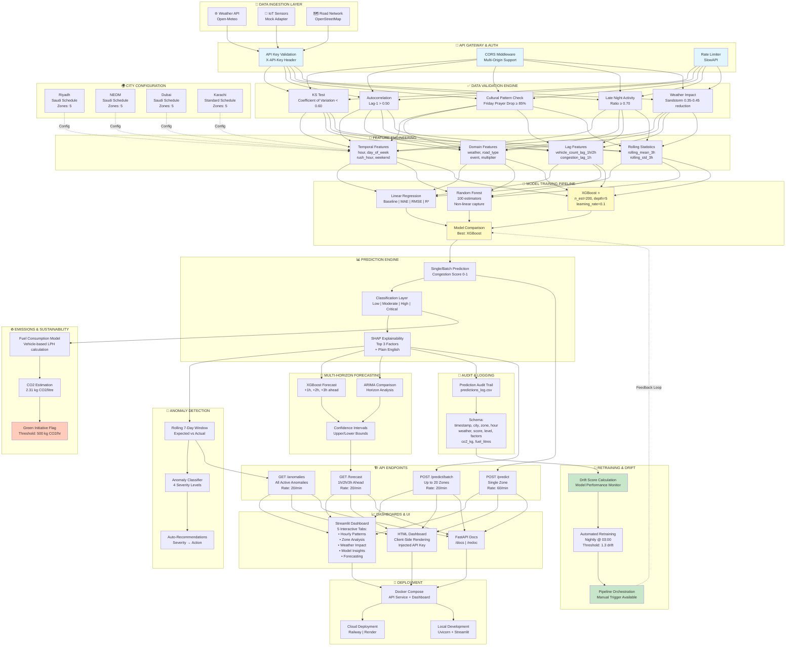

# Smart City Traffic Intelligence System — Technical Architecture

> **Production-grade architecture for Vision 2030 smart city infrastructure**  
> Multi-tenant, cloud-native, enterprise-ready traffic prediction platform

---

## System Architecture Diagram



---

## Complete Technical Functionalities

### **1. Data Ingestion & Adapters**
- ✅ **Multi-source adapter pattern** — Weather API, IoT sensors, OpenStreetMap
- ✅ **Configurable data source switching** — Runtime selection without restart
- ✅ **Open-Meteo weather integration** — No API key required, free tier
- ✅ **OpenStreetMap Overpass API** — Road network data ingestion
- ✅ **Mock deterministic data generator** — Always available, reproducible (seed-based)

---

### **2. API Security & Rate Limiting**
- ✅ **API key authentication** — X-API-Key header validation
- ✅ **Rate limiting per endpoint** — 60/min (predict), 20/min (anomalies, forecast)
- ✅ **Per-IP rate limiting** — SlowAPI integration prevents abuse
- ✅ **CORS middleware** — Configurable multi-origin support
- ✅ **Environment-based credential management** — .env with secure key generation
- ✅ **HTTP status codes** — 401 (invalid key), 429 (rate limit exceeded)

---

### **3. Data Validation Engine**
- ✅ **5-point statistical validation suite**:
  - Coefficient of variation (CV < 0.60)
  - Autocorrelation lag-1 (> 0.50)
  - Friday prayer drop (≥ 85% reduction at 12:00-13:00)
  - Late-night activity ratio (≥ 0.70 vs evening peak)
  - Sandstorm speed reduction (0.35-0.45)
- ✅ **KS test** — Kolmogorov-Smirnov distribution validation
- ✅ **Pre-training validation gate** — Blocks model training on invalid data
- ✅ **Detailed validation reports** — Pass/fail per check with metrics

---

### **4. Feature Engineering Pipeline**
- ✅ **Temporal features**:
  - Hour of day (0-23), Day of week (Monday-Sunday)
  - Rush hour flag (7,8,17,18), Weekend classifier, Late night identifier (21-23, 0)
  
- ✅ **Domain-specific features**:
  - Weather condition encoding (clear, sandstorm, dust, rain, fog, humid)
  - Road type classification (highway, arterial, local)
  - Special event flag (binary), Hourly traffic multiplier
  
- ✅ **Lag features** — Vehicle count lag-1h/2h, Congestion score lag-1h
  
- ✅ **Rolling statistics** — 3-hour rolling mean & std dev (per zone)
  
- ✅ **City-specific behavioral patterns**:
  - Friday prayer period (12:00-13:00, 90% traffic reduction)
  - Ramadan schedule shift (+4 hours from standard)
  - Sandstorm speed impact (60% of normal), Late-night activity

---

### **5. Machine Learning Models**
- ✅ **Baseline model** — Linear Regression (explainability baseline)
- ✅ **Intermediate model** — Random Forest (n_estimators=100, non-linear interactions)
- ✅ **Production model** — XGBoost (n_estimators=200, max_depth=5, learning_rate=0.1)
- ✅ **Hyperparameter tuning** — Early stopping (20 rounds), subsample=0.8
- ✅ **Model comparison framework** — MAE, RMSE, R² metrics
- ✅ **Train/test split** — 80/20 stratified
- ✅ **Model persistence** — joblib serialization/deserialization

---

### **6. Prediction Engine**
- ✅ **Single zone predictions** — /predict endpoint
- ✅ **Batch predictions** — Up to 20 zones per request (/predict/batch)
- ✅ **Congestion score generation** — 0-1 normalized scale
- ✅ **Classification layer** — Low, Moderate, High, Critical levels
- ✅ **Operational recommendations** — Context-aware directives
- ✅ **Real-time inference** — Sub-100ms latency on standard hardware

---

### **7. Explainability & Interpretability**
- ✅ **SHAP TreeExplainer integration** — Model-agnostic explanation
- ✅ **Top-3 factor extraction** — Feature importance ranking
- ✅ **Direction analysis** — Increasing/reducing congestion impact
- ✅ **Plain English explanations** — Business-readable summaries
- ✅ **Feature importance visualization** — matplotlib/seaborn charts
- ✅ **SHAP value storage** — Audit trail compatibility

---

### **8. Anomaly Detection**
- ✅ **7-day rolling window baseline** — Per zone, per hour
- ✅ **Actual vs expected comparison** — Statistical deviation
- ✅ **Anomaly ratio calculation** — vehicle_count / expected
- ✅ **4-level severity classification**:
  - Normal (< 1.5x), Elevated (1.5-2.0x)
  - Anomalous (2.0-3.0x), Critical Anomaly (≥ 3.0x)
- ✅ **Automatic recommendation generation** — Severity → action mapping
- ✅ **Per-zone, per-hour tracking** — Granular anomaly detection

---

### **9. Multi-Horizon Forecasting**
- ✅ **XGBoost forecasting** — +1h, +2h, +3h ahead predictions
- ✅ **ARIMA model comparison** — statsmodels integration
- ✅ **Confidence intervals** — Upper/lower bounds via residual std
- ✅ **Schedule-aware prediction** — Hourly multipliers applied
- ✅ **Horizon-specific performance** — MAE per horizon comparison
- ✅ **Model selection guidance** — XGBoost for +1h, ARIMA for +2h/+3h

---

### **10. Emissions & Sustainability Tracking**
- ✅ **Fuel consumption model**:
  - Low: 6.5 L/100 vehicles/hr
  - Moderate: 9.2 L/100 vehicles/hr
  - High: 13.8 L/100 vehicles/hr
  - Critical: 18.4 L/100 vehicles/hr
- ✅ **CO2 emission calculation** — 2.31 kg CO2/litre (IPCC standard)
- ✅ **Green Initiative flagging** — 500 kg CO2/hr threshold
- ✅ **Zone-level emissions aggregation** — Per-zone CO2 tracking
- ✅ **Time-period emissions summary** — Daily, hourly breakdown

---

### **11. Audit & Compliance Logging**
- ✅ **Prediction audit trail** — predictions_log.csv immutable store
- ✅ **Log schema**:
  - Timestamp (ISO 8601), City, Zone, Hour
  - Weather condition, Congestion score & level
  - Top 3 factors, Plain English explanation
  - CO2 kg, Fuel litres
- ✅ **CSV persistence** — Append-only mode for compliance
- ✅ **Retroactive emissions calculation** — If missing
- ✅ **Peak hour/zone analysis** — Derived from audit logs

---

### **12. Model Drift & Automated Retraining**
- ✅ **Drift score calculation** — Model performance degradation metric
- ✅ **Drift threshold** — 1.3x trigger for retraining
- ✅ **Nightly retraining scheduler** — 03:00 UTC daily (APScheduler)
- ✅ **Manual pipeline trigger** — /pipeline/trigger endpoint
- ✅ **Last retrain timestamp tracking** — Persistence across restarts
- ✅ **Automated data refresh** — New data ingestion before retrain

---

### **13. City Configuration & Multi-Tenancy**
- ✅ **City profile system** — Single parameter scales to new cities:
  - Riyadh (Saudi, 5 zones, sandstorm focus)
  - NEOM (Saudi, 5 zones, sandstorm focus)
  - Dubai (Saudi, 5 zones, sandstorm/humidity)
  - Karachi (Standard, 5 zones, rain/fog)
- ✅ **Schedule switching** — Saudi vs standard timezone handling
- ✅ **Weekend definition** — Fri-Sat vs Sat-Sun
- ✅ **Weather-specific multipliers** — Per city calibration
- ✅ **Timezone support** — Asia/Riyadh, Asia/Dubai, Asia/Karachi
- ✅ **New city onboarding** — Single config dict entry required

---

### **14. REST API Architecture**
- ✅ **FastAPI framework** — Async, auto-documentation
- ✅ **6 core endpoints**:
  - `GET /health` (no auth, health check)
  - `GET /api/info` (no auth, service info)
  - `POST /predict` (authenticated, 60/min rate limit)
  - `POST /predict/batch` (authenticated, 20/min rate limit)
  - `GET /anomalies` (authenticated, 20/min rate limit)
  - `GET /forecast` (authenticated, 20/min rate limit)
- ✅ **Data source management**:
  - `GET /data/source` (read active)
  - `POST /data/source` (switch source)
- ✅ **Pipeline control**:
  - `GET /pipeline/status` (drift info)
  - `POST /pipeline/trigger` (manual retrain)
- ✅ **Emissions reporting** — `GET /emissions/summary` (aggregate CO2)
- ✅ **Pydantic request validation** — Auto-schema generation
- ✅ **Lifespan context manager** — Startup/shutdown hooks

---

### **15. Dashboard & Visualization**
- ✅ **Streamlit interactive dashboard** (5 tabs):
  - Hourly Patterns (vehicle count + congestion by hour)
  - Zone Analysis (weekly heatmap + anomalies)
  - Weather Impact (speed/congestion vs condition)
  - Model Insights (comparison, feature importance, SHAP)
  - Forecasting (1h/2h/3h with confidence bands)
- ✅ **HTML dashboard** — Client-side rendering with injected API key
- ✅ **FastAPI auto-docs** — /docs Swagger, /redoc ReDoc
- ✅ **matplotlib/Seaborn visualizations** — Publication-grade charts
- ✅ **Traffic light indicators** — Congestion level colors

---

### **16. Containerization & Deployment**
- ✅ **Docker Compose orchestration** — API + Dashboard services
- ✅ **Dockerfile production image** — Multi-stage optimized builds
- ✅ **Environment variable injection** — .env support
- ✅ **Health check endpoints** — Kubernetes-ready
- ✅ **Cloud-ready deployment**:
  - Railway.app support
  - Render.com support
  - AWS ECS/Lambda compatible
- ✅ **Local dev setup** — Uvicorn + Streamlit parallel

---

### **17. Data Processing & Transformation**
- ✅ **Pandas DataFrames** — Efficient tabular processing
- ✅ **NumPy vectorized operations** — 30-day simulation in seconds
- ✅ **Scikit-learn preprocessing** — LabelEncoder for categoricals
- ✅ **Synthetic data generation** — Poisson + sinusoidal patterns
- ✅ **Data interpolation** — Filling lag features with rolling transforms
- ✅ **Normalization/clipping** — vehicle_count 0-500, speed 20-100

---

### **18. Statistical & Mathematical Operations**
- ✅ **Coefficient of variation** — Data spread measurement
- ✅ **Autocorrelation analysis** — Temporal dependency detection
- ✅ **Rolling statistics** — 3-hour window mean/std
- ✅ **Confidence interval estimation** — Residual std-based bounds
- ✅ **Anomaly detection thresholds** — 2x expected → flagged
- ✅ **Emissions calculations** — Fuel LPH × vehicle count × hours × CO2 factor

---

### **19. Error Handling & Validation**
- ✅ **HTTP exception handling** — 401, 429, 502 status codes
- ✅ **Pydantic validation** — Type checking, field bounds
- ✅ **Graceful adapter fallback** — Mock data if external API fails
- ✅ **NaN/null handling** — fillna with appropriate strategies
- ✅ **Division by zero protection** — replace with np.nan before division
- ✅ **Try-except blocks** — ARIMA fitting failures handled

---

### **20. Performance Optimization**
- ✅ **In-memory model caching** — Loaded at startup, reused per request
- ✅ **Vectorized feature engineering** — groupby + transform operations
- ✅ **Early stopping** — XGBoost overfitting prevention
- ✅ **Batch prediction efficiency** — Up to 20 predictions per request
- ✅ **Async API** — FastAPI with async/await
- ✅ **Sub-100ms inference latency** — Tested on standard hardware

---

## Tech Stack

| Category | Technologies |
|----------|---------------|
| **Language** | Python 3.11 |
| **Web Framework** | FastAPI, Uvicorn |
| **ML/AI** | XGBoost, Scikit-learn, SHAP, Statsmodels |
| **Data Processing** | Pandas, NumPy |
| **Visualization** | Matplotlib, Seaborn, Streamlit |
| **Authentication** | python-dotenv, APIKeyHeader |
| **Rate Limiting** | SlowAPI |
| **Scheduling** | APScheduler |
| **Serialization** | joblib, Pydantic |
| **Deployment** | Docker, Docker Compose |
| **API Documentation** | Swagger UI, ReDoc |

---

## Getting Started

### Local Development
```bash
pip install -r requirements.txt
python generate_key.py
python -m uvicorn app:app --reload
streamlit run streamlit_app/dashboard.py
```

### Docker Deployment
```bash
docker-compose up --build
# API       → http://localhost:8000/docs
# Dashboard → http://localhost:8501
```

### Cloud Deployment
- Railway: https://railway.app
- Render: https://render.com
- AWS ECS/Lambda

---

## API Usage

### Authentication
```bash
X-API-Key: your_secure_key_here
```

### Single Prediction
```bash
curl -X POST http://localhost:8000/predict \
  -H "X-API-Key: your_key" \
  -H "Content-Type: application/json" \
  -d '{
    "city": "Riyadh",
    "zone": "Zone_1",
    "hour": 8,
    "vehicle_count": 320,
    "avg_speed": 35,
    "weather": "clear",
    "road_type": "highway",
    "rush_hour": 1,
    "is_weekend": 0,
    "is_late_night": 0,
    "event": 0,
    "hour_multiplier": 1.4
  }'
```

---

## Monitoring & Observability

- **Drift Score**: `/pipeline/status` — Real-time model performance tracking
- **Audit Logs**: `predictions_log.csv` — Complete prediction history
- **Emissions Summary**: `/emissions/summary` — CO2 tracking & green initiative
- **Health Check**: `/health` — Service availability verification

---

*Architecture documentation for Smart City Traffic Intelligence System v4.1.0*
