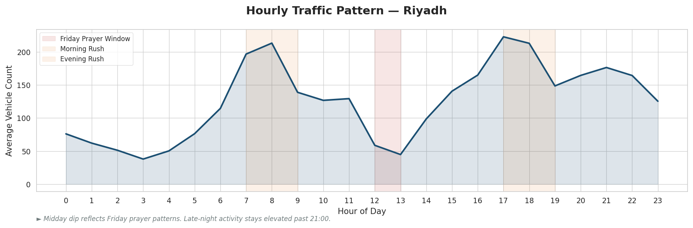
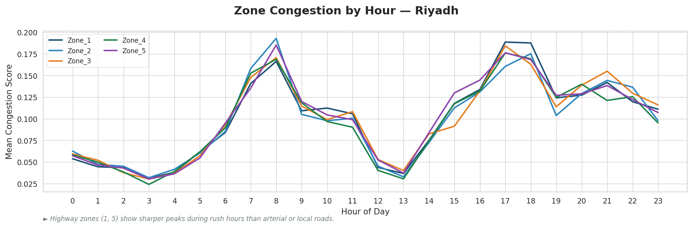
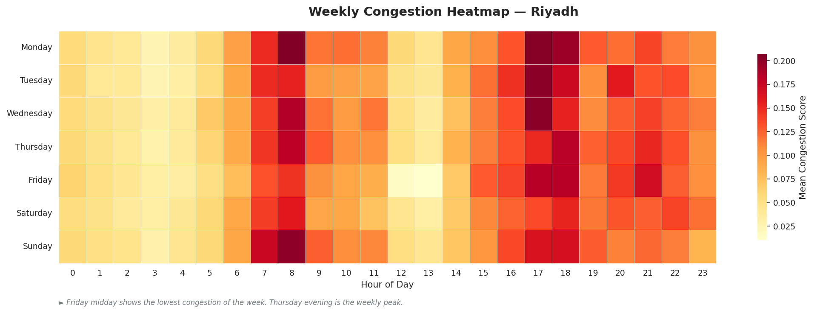
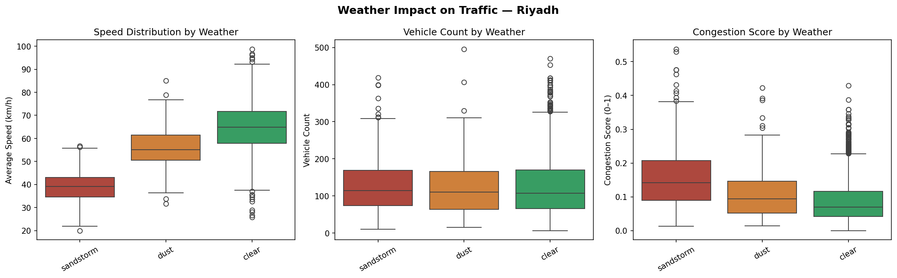

# Smart City Traffic Intelligence System

A scalable traffic analysis and forecasting framework for Vision 2030 smart cities.  
Demonstrated on Riyadh — configurable for any city.

---

## Problem

Urban traffic management in rapidly growing smart cities requires more than historical reporting.  
City planners need to know **when congestion will happen**, **what causes it**, and **which zones need intervention** — before gridlock occurs.

---

## What This Project Does

- Generates realistic hourly traffic data configurable for any city
- Models Saudi-specific patterns: Friday prayer drop, late-night activity, Ramadan schedule shift
- Analyzes weather impact including sandstorm — the most disruptive condition in Gulf cities
- Forecasts congestion using ARIMA, LSTM, and XGBoost
- Visualizes patterns at city, zone, and weekly resolution

---

## Visualizations

### Hourly Traffic Pattern


### Zone Congestion by Hour


### Weekly Congestion Heatmap


### Weather Impact Analysis


---

## Key Findings

- **Sandstorms** reduce average speed by ~40% — the single biggest traffic disruptor in Riyadh
- **Friday prayer (12:00–13:00)** causes the lowest traffic of the entire week across all zones
- **Late-night hours (21:00–23:00)** remain as congested as evening rush — unique to Saudi cities
- **Highway zones** show sharper congestion peaks than arterial or local roads during rush hours

---

## City Configuration

The pipeline accepts any city as input via `CITY_PROFILES`:

```python
riyadh_df = generate_traffic_data(city='Riyadh', n_days=30, zones=5)
dubai_df  = generate_traffic_data(city='Dubai',  n_days=30, zones=5)
```

Adding a new city requires one dictionary entry — no changes to downstream code.

---

## Modeling Approach

| Model | Purpose |
|---|---|
| ARIMA | Baseline time-series forecasting, trend and seasonality |
| LSTM | Non-linear multivariate traffic sequence prediction |
| XGBoost | Congestion score regression with feature importance |

Models are evaluated on MAE and RMSE.

---

## Project Structure

```
smart-city-traffic-model/
│
├── notebook/
│   └── smart_city_traffic.ipynb
│
├── outputs/
│   ├── hourly_pattern_riyadh.png
│   ├── zone_congestion_riyadh.png
│   ├── weekly_heatmap_riyadh.png
│   └── weather_impact_riyadh.png
│
├── requirements.txt
└── README.md
```

---

## Setup

```bash
git clone https://github.com/MuhammadTalha121/smart-city-traffic-model.git
cd smart-city-traffic-model
pip install -r requirements.txt
```

---

## Tech Stack

`Python` `Pandas` `NumPy` `Matplotlib` `Seaborn` `Plotly` `Scikit-learn` `TensorFlow` `XGBoost` `Statsmodels`

---

## Roadmap

- [x] City-agnostic data generation
- [x] Saudi-specific hourly patterns and Ramadan schedule
- [x] Weather impact analysis with sandstorm modeling
- [x] Professional visualization suite
- [ ] XGBoost feature importance analysis
- [ ] Model evaluation and comparison
- [ ] FastAPI deployment endpoint

---

*Built as part of a data science portfolio targeting Saudi Arabia's Vision 2030 smart city initiatives.*
